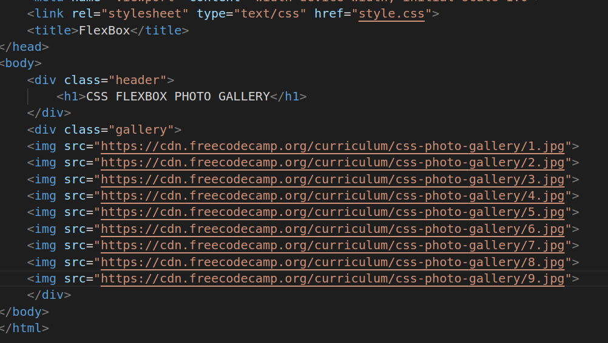
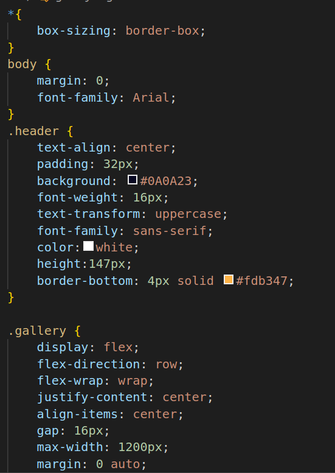
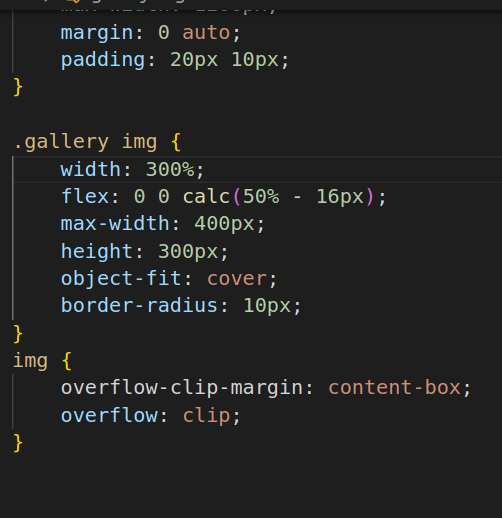

# FlexBox Photo Gallery App
1.
* link rel: This is a link element used to include an external stylesheet. It references a file called "style.css" using the href attribute. This external CSS file is used to style the HTML elements on the page.
* div class="header": This is a div element with a class attribute set to "header." div elements are commonly used as containers to group and style other elements. In this case, it is likely used to create a header section on the webpage.
* h1:The h1 element represents a top-level heading. It is used to display a large, bold title on the page. In this case, it is the main title for the photo gallery.
* div class="gallery": Another div element with a class attribute set to "gallery." This is likely used to define a section of the webpage where the photo gallery will be displayed.
* img src: This is an image element that displays an image. The src attribute specifies the source URL of the image.

2.

* *: This is a universal selector (*) that sets the box-sizing property to "border-box" for all HTML elements. This property ensures that when you set the width and height of an element, it includes the padding and border within the specified dimensions, preventing the content from overflowing its container.
* body { margin: 0; font-family: Arial; }: These styles are applied to the body element.
* margin: 0: This removes any default margin around the body element, ensuring that content starts from the edge of the viewport.
* font-family: Arial: It sets the font-family for text within the body to Arial.
* header: These styles are applied to elements with the class "header" (likely the header section of the webpage).
* text-align: center: This centers the text within the header horizontally.
padding: 32px: It adds padding around the content inside the header.
* background: #0A0A23: This sets the background color of the header to a dark blue color.
* font-weight: 16px: This is incorrect; font-weight should be a numeric value, like font-weight: bold. It's likely a typo.
* text-transform: uppercase: This makes the text in the header uppercase.
* font-family: sans-serif: It sets a sans-serif font for text in the header.
* color: white: This sets the text color to white.
* height: 147px: It defines the height of the header.
* border-bottom: 4px solid #fdb347: This adds a 4-pixel solid border at the bottom of the header in a specific color.
* gallery: These styles are applied to elements with the class "gallery" (likely the gallery section of the webpage).
* display: flex: This makes the gallery section a flex container.
* flex-direction: row: It sets the direction of the flex items to be in a row (horizontally).
* flex-wrap: wrap: If the content overflows, it wraps to the next line.
* justify-content: center: It centers the flex items along the main axis.
* align-items: center: It centers the flex items along the cross-axis
* gap: 16px: It adds a 16-pixel gap between flex items.
* max-width: 1200px: It limits the maximum width of the gallery section to 1200 pixels.
* margin: 0 auto: This centers the gallery section horizontally within its parent container.
* padding: 20px 10px: It adds padding to the top and bottom (20px) and left and right (10px) of the gallery section.

3.

* gallery img: These styles are applied to all img elements within the gallery.
* width: 300%: This increases the image width to 300% of its parent container, likely for responsiveness.
* flex: 0 0 calc(50% - 16px): This defines the flex properties of the images within the flex container. It specifies that the images won't grow or shrink (flex: 0 0), and they should take up half of the container minus 16 pixels, with a 16-pixel gap between them.
* max-width: 400px: It sets a maximum width for the images to prevent them from becoming too large.
* height: 300px: It sets a fixed height for the images.
* object-fit: cover;: This ensures that the image covers the entire container and maintains its aspect ratio.
border-radius: 10px;: It rounds the corners of the images with a 10-pixel radius.

# Hosted Link
 https://nikhitha5511.github.io/FlexBox/?authuser=0
